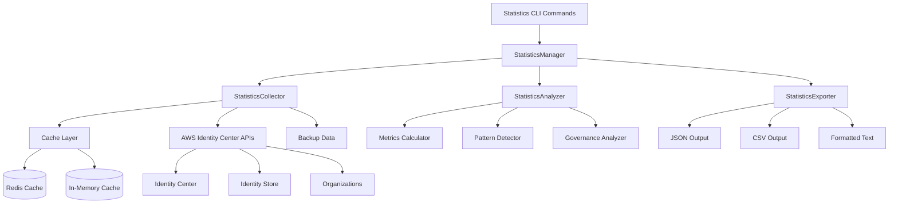

# Design Document

## Overview

The Statistics module provides comprehensive analytics and reporting capabilities for AWS Identity Center environments. It follows the established awsideman architecture patterns, integrating with the existing cache system, AWS client management, and CLI structure. The module collects real-time data from Identity Center APIs and optionally compares with historical backup snapshots to generate actionable insights about user distributions, permission patterns, and governance gaps.

## Architecture

### High-Level Architecture



### Module Structure

The statistics module follows the established awsideman patterns:

```
src/awsideman/statistics/
├── __init__.py                 # Module exports
├── manager.py                  # Main StatisticsManager class
├── collector.py                # Data collection from AWS APIs
├── analyzer.py                 # Statistical analysis and calculations
├── exporter.py                 # Output formatting and export
├── models.py                   # Data models and types
├── interfaces.py               # Abstract interfaces
└── helpers.py                  # Utility functions

src/awsideman/commands/statistics/
├── __init__.py                 # CLI app registration
├── generate.py                 # Main statistics generation command
├── export.py                   # Export-specific commands
└── helpers.py                  # CLI helper functions
```

## Components and Interfaces

### Core Interfaces

```python
class StatisticsCollectorInterface(Protocol):
    """Interface for statistics data collection."""

    async def collect_user_statistics(self) -> UserStatistics
    async def collect_group_statistics(self) -> GroupStatistics
    async def collect_permission_set_statistics(self) -> PermissionSetStatistics
    async def collect_account_statistics(self) -> AccountStatistics
    async def collect_assignment_statistics(self) -> AssignmentStatistics

class StatisticsAnalyzerInterface(Protocol):
    """Interface for statistical analysis."""

    def analyze_user_patterns(self, data: UserStatistics) -> UserAnalysis
    def analyze_permission_usage(self, data: PermissionSetStatistics) -> PermissionAnalysis
    def analyze_governance_gaps(self, data: Dict[str, Any]) -> GovernanceAnalysis
    def compare_historical_data(self, current: Any, historical: Any) -> TrendAnalysis

class StatisticsExporterInterface(Protocol):
    """Interface for statistics export."""

    def export_json(self, statistics: StatisticsReport) -> str
    def export_csv(self, statistics: StatisticsReport) -> str
    def export_text(self, statistics: StatisticsReport) -> str
```

### StatisticsManager

The main orchestrator that coordinates data collection, analysis, and export:

```python
class StatisticsManager:
    """Main manager for statistics operations."""

    def __init__(self, client_manager: AWSClientManager, instance_arn: str):
        self.client_manager = client_manager
        self.instance_arn = instance_arn
        self.collector = StatisticsCollector(client_manager, instance_arn)
        self.analyzer = StatisticsAnalyzer()
        self.exporter = StatisticsExporter()

    async def generate_statistics(
        self,
        categories: List[str] = None,
        filters: Dict[str, Any] = None,
        include_historical: bool = False
    ) -> StatisticsReport:
        """Generate comprehensive statistics report."""

    async def generate_user_group_statistics(self) -> UserGroupStatistics
    async def generate_permission_set_statistics(self) -> PermissionSetStatistics
    async def generate_account_statistics(self) -> AccountStatistics
    async def generate_assignment_patterns(self) -> AssignmentPatterns
    async def generate_governance_view(self) -> GovernanceView
```

### StatisticsCollector

Responsible for gathering data from AWS Identity Center APIs with caching support:

```python
class StatisticsCollector:
    """Collects raw data from AWS Identity Center APIs."""

    def __init__(self, client_manager: AWSClientManager, instance_arn: str):
        self.client_manager = client_manager
        self.instance_arn = instance_arn
        self.cache_enabled = client_manager.is_caching_enabled()

    async def collect_all_data(self) -> RawStatisticsData:
        """Collect all required data for statistics generation."""

    async def collect_users(self) -> List[UserData]
    async def collect_groups(self) -> List[GroupData]
    async def collect_permission_sets(self) -> List[PermissionSetData]
    async def collect_assignments(self) -> List[AssignmentData]
    async def collect_accounts(self) -> List[AccountData]

    def get_historical_data(self, backup_path: str) -> Optional[RawStatisticsData]:
        """Load historical data from backup snapshots."""
```

### StatisticsAnalyzer

Performs calculations and pattern analysis on collected data:

```python
class StatisticsAnalyzer:
    """Analyzes collected data to generate insights."""

    def calculate_user_group_metrics(self, users: List[UserData], groups: List[GroupData]) -> UserGroupMetrics
    def calculate_permission_set_metrics(self, permission_sets: List[PermissionSetData], assignments: List[AssignmentData]) -> PermissionSetMetrics
    def calculate_account_metrics(self, accounts: List[AccountData], assignments: List[AssignmentData]) -> AccountMetrics
    def calculate_assignment_patterns(self, assignments: List[AssignmentData]) -> AssignmentPatterns

    def detect_orphaned_resources(self, data: RawStatisticsData) -> OrphanedResources
    def detect_privileged_access(self, permission_sets: List[PermissionSetData]) -> PrivilegedAccessReport
    def generate_access_matrix(self, data: RawStatisticsData) -> AccessMatrix

    def compare_with_historical(self, current: Any, historical: Any) -> TrendAnalysis
```

### StatisticsExporter

Handles output formatting and export to different formats:

```python
class StatisticsExporter:
    """Exports statistics in various formats."""

    def export_to_json(self, report: StatisticsReport) -> str
    def export_to_csv(self, report: StatisticsReport, category: str = None) -> str
    def export_to_text(self, report: StatisticsReport) -> str

    def format_summary_table(self, metrics: Dict[str, Any]) -> str
    def format_detailed_report(self, report: StatisticsReport) -> str
    def apply_filters(self, report: StatisticsReport, filters: Dict[str, Any]) -> StatisticsReport
```

## Data Models

### Core Statistics Models

```python
@dataclass
class UserGroupMetrics:
    """Metrics for users and groups."""
    total_users: int
    total_groups: int
    users_per_group: Dict[str, int]  # group_id -> user_count
    groups_per_user: Dict[str, int]  # user_id -> group_count
    largest_groups: List[Tuple[str, int]]  # (group_name, user_count)
    orphaned_users: List[str]  # users with no group membership or assignments
    orphaned_groups: List[str]  # groups with no members or assignments

@dataclass
class PermissionSetMetrics:
    """Metrics for permission sets."""
    total_permission_sets: int
    assignments_per_permission_set: Dict[str, int]
    most_assigned_permission_sets: List[Tuple[str, int]]
    unused_permission_sets: List[str]
    average_assignments_per_permission_set: float
    privileged_permission_sets: List[str]

@dataclass
class AccountMetrics:
    """Metrics for AWS accounts."""
    total_accounts: int
    assignments_per_account: Dict[str, int]
    users_per_account: Dict[str, int]
    groups_per_account: Dict[str, int]
    accounts_with_no_assignments: List[str]
    cross_account_users: List[Tuple[str, int]]  # (user_id, account_count)
    cross_account_groups: List[Tuple[str, int]]  # (group_id, account_count)

@dataclass
class AssignmentPatterns:
    """Assignment pattern analysis."""
    average_assignments_per_user: float
    users_with_most_assignments: List[Tuple[str, int]]
    groups_with_most_assignments: List[Tuple[str, int]]
    assignment_growth_trend: Optional[TrendData]

@dataclass
class GovernanceView:
    """Governance-oriented analysis."""
    access_matrix: AccessMatrix
    privileged_access_report: PrivilegedAccessReport
    empty_mappings: EmptyMappings
    compliance_gaps: List[ComplianceGap]

@dataclass
class StatisticsReport:
    """Complete statistics report."""
    metadata: ReportMetadata
    user_group_metrics: UserGroupMetrics
    permission_set_metrics: PermissionSetMetrics
    account_metrics: AccountMetrics
    assignment_patterns: AssignmentPatterns
    governance_view: GovernanceView
    historical_comparison: Optional[TrendAnalysis]
```

### Supporting Models

```python
@dataclass
class AccessMatrix:
    """Who has access to what matrix."""
    user_to_accounts: Dict[str, List[str]]
    user_to_permission_sets: Dict[str, List[str]]
    group_to_accounts: Dict[str, List[str]]
    group_to_permission_sets: Dict[str, List[str]]
    account_to_users: Dict[str, List[str]]
    account_to_groups: Dict[str, List[str]]

@dataclass
class PrivilegedAccessReport:
    """Report on privileged access patterns."""
    admin_permission_sets: List[str]
    accounts_with_admin_access: Dict[str, List[str]]  # account_id -> [user/group names]
    users_with_admin_access: List[str]
    high_privilege_patterns: List[PrivilegePattern]

@dataclass
class TrendAnalysis:
    """Historical trend analysis."""
    user_growth: GrowthMetric
    group_growth: GrowthMetric
    permission_set_growth: GrowthMetric
    assignment_growth: GrowthMetric
    significant_changes: List[SignificantChange]
```

## Error Handling

### Error Types

```python
class StatisticsError(Exception):
    """Base exception for statistics operations."""

class DataCollectionError(StatisticsError):
    """Error during data collection from AWS APIs."""

class AnalysisError(StatisticsError):
    """Error during statistical analysis."""

class ExportError(StatisticsError):
    """Error during report export."""

class HistoricalDataError(StatisticsError):
    """Error accessing historical backup data."""
```

### Error Handling Strategy

1. **Graceful Degradation**: If certain data cannot be collected, continue with available data
2. **Partial Results**: Return partial statistics with clear indication of missing data
3. **Retry Logic**: Implement exponential backoff for transient AWS API errors
4. **User Feedback**: Provide clear error messages and suggestions for resolution
5. **Logging**: Comprehensive logging for debugging and monitoring

## Testing Strategy

### Unit Tests

```python
# Test data collection
class TestStatisticsCollector:
    def test_collect_users_success(self)
    def test_collect_users_with_pagination(self)
    def test_collect_users_api_error(self)
    def test_cache_integration(self)

# Test analysis
class TestStatisticsAnalyzer:
    def test_calculate_user_group_metrics(self)
    def test_detect_orphaned_resources(self)
    def test_detect_privileged_access(self)
    def test_historical_comparison(self)

# Test export
class TestStatisticsExporter:
    def test_export_json_format(self)
    def test_export_csv_format(self)
    def test_export_text_format(self)
    def test_apply_filters(self)
```

### Integration Tests

```python
class TestStatisticsIntegration:
    def test_end_to_end_statistics_generation(self)
    def test_with_real_aws_data(self)
    def test_with_backup_data(self)
    def test_performance_with_large_datasets(self)
```

### Performance Tests

```python
class TestStatisticsPerformance:
    def test_large_user_base_performance(self)
    def test_memory_usage_with_large_datasets(self)
    def test_parallel_collection_efficiency(self)
    def test_cache_effectiveness(self)
```

## CLI Integration

### Command Structure

Following awsideman patterns, the statistics commands will be organized as:

```bash
# Main statistics command
awsideman statistics generate [options]

# Specific category commands
awsideman statistics users [options]
awsideman statistics groups [options]
awsideman statistics permission-sets [options]
awsideman statistics accounts [options]
awsideman statistics assignments [options]
awsideman statistics governance [options]

# Export commands
awsideman statistics export --format json --output report.json
awsideman statistics export --format csv --category users --output users.csv
```

### CLI Implementation

```python
# src/awsideman/commands/statistics/__init__.py
app = typer.Typer(
    help="Generate statistics and analytics for AWS Identity Center resources."
)

app.command("generate")(generate_statistics)
app.command("users")(generate_user_statistics)
app.command("groups")(generate_group_statistics)
app.command("permission-sets")(generate_permission_set_statistics)
app.command("accounts")(generate_account_statistics)
app.command("assignments")(generate_assignment_statistics)
app.command("governance")(generate_governance_statistics)
app.command("export")(export_statistics)
```

## Performance Considerations

### Data Collection Optimization

1. **Parallel Collection**: Use ThreadPoolExecutor for concurrent API calls
2. **Pagination Handling**: Efficient pagination for large datasets
3. **Caching Integration**: Leverage existing cache system for repeated queries
4. **Incremental Collection**: Support for collecting only changed data

### Memory Management

1. **Streaming Processing**: Process large datasets in chunks
2. **Lazy Loading**: Load data only when needed for specific analyses
3. **Memory Monitoring**: Track memory usage and implement limits
4. **Garbage Collection**: Explicit cleanup of large data structures

### Caching Strategy

1. **Cache Key Design**: Hierarchical cache keys for different data types
2. **TTL Configuration**: Appropriate cache expiration times
3. **Cache Invalidation**: Smart invalidation based on data changes
4. **Cache Warming**: Pre-populate cache for common queries

## Security Considerations

### Data Protection

1. **Sensitive Data Handling**: Mask account IDs and ARNs in outputs
2. **Access Control**: Respect existing AWS permissions
3. **Audit Logging**: Log all statistics generation activities
4. **Data Retention**: Follow organizational data retention policies

### AWS Permissions

Required AWS permissions for statistics generation:

```json
{
    "Version": "2012-10-17",
    "Statement": [
        {
            "Effect": "Allow",
            "Action": [
                "sso:ListInstances",
                "sso:ListPermissionSets",
                "sso:ListAccountAssignments",
                "sso:DescribePermissionSet",
                "sso:ListManagedPoliciesInPermissionSet",
                "sso:ListCustomerManagedPolicyReferencesInPermissionSet",
                "identitystore:ListUsers",
                "identitystore:ListGroups",
                "identitystore:ListGroupMemberships",
                "identitystore:DescribeUser",
                "identitystore:DescribeGroup",
                "organizations:ListAccounts"
            ],
            "Resource": "*"
        }
    ]
}
```

## Integration Points

### Existing awsideman Components

1. **Cache System**: Integrate with existing cache infrastructure
2. **AWS Client Manager**: Use established client management patterns
3. **Backup System**: Access historical data from backup snapshots
4. **CLI Framework**: Follow established CLI patterns and conventions
5. **Configuration**: Use existing configuration management

### External Systems

1. **Monitoring Systems**: Export metrics in formats suitable for monitoring
2. **Dashboards**: Provide structured data for dashboard integration
3. **Reporting Tools**: Support common reporting tool formats
4. **Audit Systems**: Integration with audit and compliance systems

## Future Enhancements

### Phase 2 Features

1. **Real-time Monitoring**: Continuous statistics collection and alerting
2. **Predictive Analytics**: ML-based predictions for access patterns
3. **Automated Recommendations**: Suggest optimizations based on patterns
4. **Custom Metrics**: User-defined metrics and calculations
5. **API Endpoints**: REST API for programmatic access

### Scalability Improvements

1. **Distributed Processing**: Support for distributed statistics generation
2. **Database Backend**: Optional database storage for large environments
3. **Streaming Analytics**: Real-time stream processing capabilities
4. **Multi-region Support**: Statistics across multiple AWS regions
